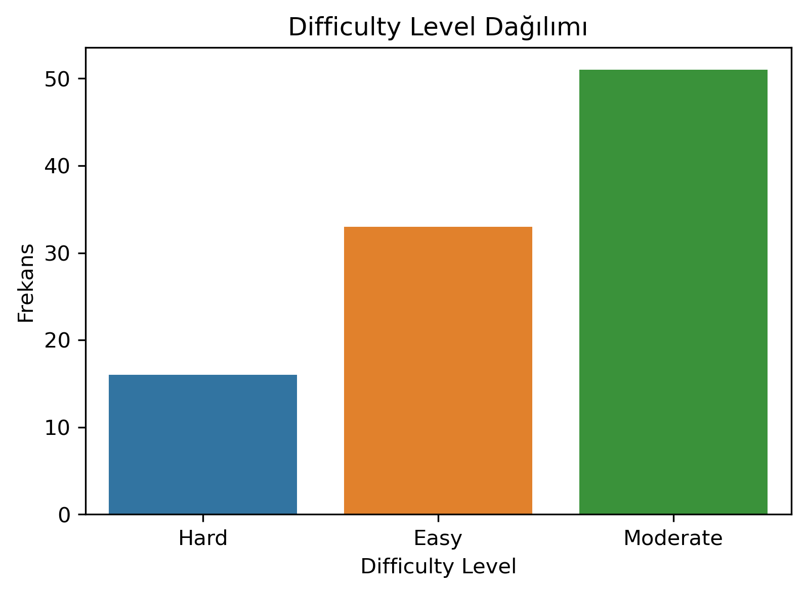
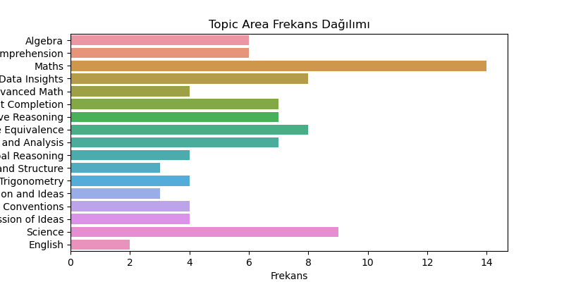
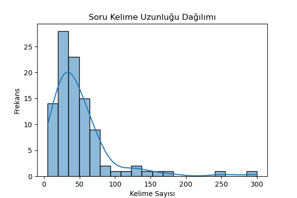
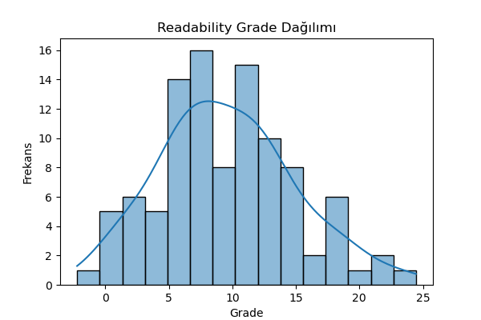

# Standardized Test Question Difficulty Prediction
Bu proje, sınav sorularının zorluk seviyesini (Easy / Moderate / Hard) otomatik tahmin etmek amacıyla geliştirilmiştir.
Model, soru metni, kelime uzunluğu, konu alanı, okunabilirlik skoru gibi özellikleri kullanarak bir sınıflandırma yapar.Bu çalışmada makine öğrenimi modelleri kullanılarak önce sayısal regresyon, ardından sınıflandırma tabanlı yaklaşımlar denenmiş ve en başarılı model belirlenmiştir.  
Burada tahmin etmek istediğimiz problem şudur:

Bir sınav sorusunun özellikleri verilince, bu sorunun zorluk seviyesini doğru tahmin edebilir miyiz?

## Projenin Amacı
Geleneksel olarak soru zorluk seviyeleri uzmanlar tarafından manuel olarak belirlenir. Bu süreç zaman alıcıdır ve her soruda tutarlı değerlendirme yapmak zordur.   
Bu proje şu sorulara yanıt aramaktadır:    
Soru metninin özellikleri kullanılarak zorluk seviyesi tahmin edilebilir mi?  
Bu amaçla aşağıdaki faktörler analiz edilmiştir:

- Test türü

- Konu alanı

- Okunabilirlik seviyesi

- Seçenek sayısı

- Hesap makinesi gerektirip gerektirmemesi
  
Bu özelliklerin zorluk seviyesi üzerindeki etkisi analiz edilmiştir.

## Dataset Hakkında
Dataset, standart test sorularına ait 100 örnekten oluşmaktadır. Her soru şu bilgileri içerir:

- Test_Name (SAT Math, GRE Verbal, ACT, GMAT…)

- Topic_Area (Algebra, Reading, Data Insights…)

- Question_Text

- Options_Count

- Question_Length_Words

- Readability_Grade

- Requires_Calculator

- Difficulty_Level (Easy, Moderate, Hard → hedef değişken)
  
Hedef değişken:

Easy = 0

Moderate = 1

Hard = 2

Dataset temizdir ve eksik değer bulunmamaktadır.

## Keşifsel Veri Analizi
Notebook içinde aşağıdaki analizler yapılmıştır:

### Difficulty Level dağılımı

→ Veri setinde Easy / Moderate / Hard sınıflarının dengeli olup olmadığı incelenmiştir.  

- "Hard" sınıfı diğer sınıflara göre daha fazladır.

- "Moderate" sınıfı çok az örneğe sahiptir → Bu, modellerin bu sınıfı öğrenmesini zorlaştırmıştır.

- Sınıf dengesizliği Logistic Regression ve RF performansını doğrudan etkilemiştir.

### Topic Area frekans grafiği

→  Soruların ait olduğu konu alanlarının dağılımı incelenmiştir.

- En fazla soru “Math” ve “Data Insights” alanlarında toplanmıştır.

- Konu alanı ile zorluk seviyesi arasında zayıf fakat gözlemlenebilir bir ilişki bulunmaktadır.

- Özellikle Reading Comprehension sorularının daha çok Easy/Moderate seviyesine sahip olduğu görülmüştür.

### Question Length histogramı

→  Soru metinlerinin kelime sayıları incelenmiştir.  

- Soru uzunlukları geniş bir aralıkta değişmektedir.

- Hard sorular genellikle daha uzun olma eğilimindedir.

- Easy soruların büyük kısmı daha kısa metinlerden oluşur.

Bu özellik model için önemli bir belirleyici olmuştur.

### Readability Grade histogramı

→ Soruların okunabilirliğini ölçen "Readability_Grade" değişkeni analiz edilmiştir.  

- Okunabilirlik skoru arttıkça zorluk seviyesinin de arttığı görülmektedir.

- Hard soruların okunabilirlik seviyesi daha yüksektir.

- Bu nedenle readability, modelde önemli bir özellik olarak değerlendirilmiştir.

#### EDA sonunda şu sonuçlara ulaşılmıştır:

- Sınıf dağılımı dengesizdir → Moderate sınıfı az.

- Soru uzunluğu ve okunabilirlik seviyesi zorlukla doğrudan ilişkilidir.

- Konu alanı etkili fakat tek başına belirleyici değildir.

- Eksik veri bulunmamaktadır → Veri temizleme ihtiyacı yoktur.

- Özelliklerin model tarafından öğrenilebilecek yeterli varyansı vardır.

Bu analizler, model seçiminde önemli bir temel oluşturmuştur.
## Kullanılan Modeller

Bu projede üç farklı model denenmiştir:

### Linear Regression

- Regression modeli sınıflandırma problemine uygun değildir.

- Sayısal tahmin üretir, sınıfı direkt veremez.

- R² negatif → Yetersiz performans.

###  Logistic Regression

- Çok sınıflı sınıflandırma için uygundur.

- Hard sınıfında güçlü performans (%82 recall).

- Moderate sınıfında başarısız → Veri az.

###  Random Forest Classifier (Final Model)

- Küçük ve dengesiz veri setlerinde kararlı.

- Easy ve Hard sınıflarında en iyi performans.

- Doğrusal olmayan ilişkileri öğrenebilir.

- Bu nedenle final model olarak seçilmiştir.
  
## Model Sonuçlarının Karşılaştırılması

Aşağıdaki tablo modellerin performansını özetler:

| Model | Accuracy | Macro F1 | Açıklama |
|-------|----------|----------|-----------|
| Linear Regression | — | — | Sınıflandırmaya uygun değil |
| Logistic Regression | **0.50** | **0.29** | Moderate sınıfı öğrenemedi |
|  Random Forest |  **0.55** |  **0.49** | En başarılı model |

## Grafikler
### Linear Regression

- Scatter Plot (Gerçek – Tahmin)

- Residual Plot

- Residual Histogram

### Logistic Regression

- Confusion Matrix

### Random Forest

- Confusion Matrix

- Feature Importance Grafiği

Bu grafikler model davranışını ve hata dağılımını görsel olarak açıklamaktadır.

## Neden Random Forest En Başarılı Model Oldu?

- Ensemble yapısı sayesinde genelleme yeteneği yüksek.

- Küçük datasetlerde Logistic Regression’dan daha dengeli.

- Doğrusal olmayan ilişkileri yakalayabilir.

- Hard sınıfında en yüksek recall değerine ulaştı.

- Weighted F1 diğer modellerden daha yüksek.

Bu nedenlerle final model olarak seçilmiştir.

## Sonuç

Bu projede standart test sorularının zorluk seviyesini tahmin etmek için üç farklı model denenmiş ve Random Forest’ın en başarılı sonuçları verdiği gösterilmiştir.

Daha büyük ve dengeli bir dataset ile model performansı önemli ölçüde artırılabilir.

